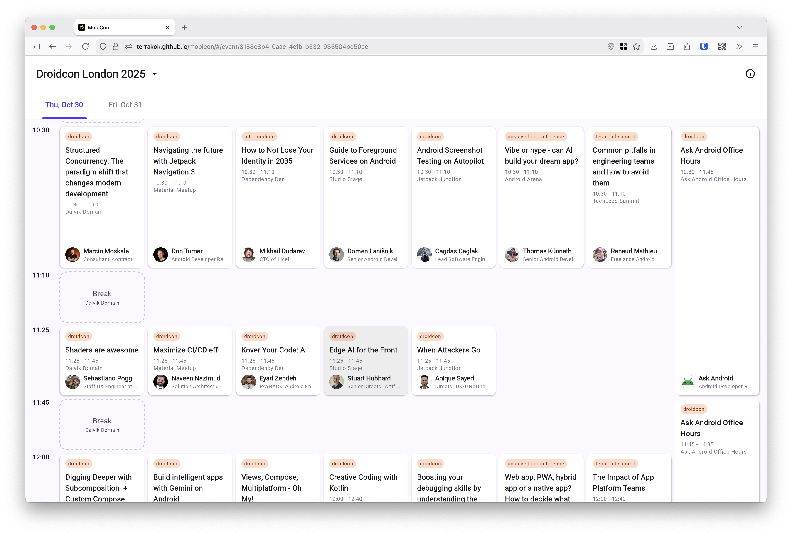

# MobiCon

DroidCon, FlutterCon and T3 conferences app.

https://terrakok.github.io/mobicon

Compose Multiplatform Application.
- adaptive design (desktop/mobile)
- deeplink support
- modern stack (Metro DI, Navigation3, etc)
- saving a selected conference between launches
